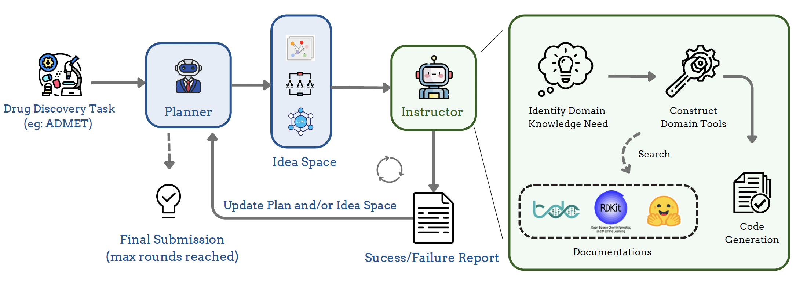

# DrugAgent: Automating AI-aided Drug Discovery Programming through LLM Multi-Agent Collaboration

## Overview

<p align="center">
  
</p>

DrugAgent is a multi-agent LLM framework that unifies ML programming with biomedical expertise to address the demands of modern drug discovery. It integrates two primary agents: (1) an LLM Planner, which manages the high-level generation and refinement of solution ideas, and (2) an LLM Instructor, which translates these ideas into concrete code, drawing on domain-specific knowledge to address the complex needs of drug discovery tasks.

## Installation

DrugAgent is built upon the MLAgentBench project. We thank the original authors for their valuable work. To install DrugAgent, follow the steps below:

1. **Clone the Repository**

   ```bash
   git clone https://github.com/Steven51516/drugagent.git
   cd drugagent
   ```

2. **Create a New Conda Environment**

   ```bash
    conda create --name drugagent python=3.10
    conda activate drugagent
   ```
2. **Install Dependencies**
   ```bash
   pip install -r requirements.txt
   ```


# Quick Start

DrugAgent uses [LiteLLM](https://github.com/BerriAI/litellm) for model integration.  
Before running, please set up the API key for your chosen LLM according to the LiteLLM documentation.  

To run our drugagent on admet task with openai API using gpt-4o-mini:

```
python -u -m drugagent.runner --task admet --device 0 --log-dir first_test  --work-dir workspace  >  log 2>&1 --llm-name openai/gpt-4o-mini --edit-script-llm-name openai/gpt-4o-mini --fast-llm-name openai/gpt-4o-mini
```


This will produce logs in `first_test` directory with the following structure
```
first_test/
    agent_log/
        Planner_log # log showing Planner agent's research process
        Insturctor_log # log showing Instructor agent's research process
        agent_*.json # saved agent states
        ...
    env_log/
        tool_logs/ 
        traces/ # snap shots of the agent workspace
        trace.json # interaction trace of the agent
        ...
```
## Output Structure

By default, the agent saves the best answer file based on validation results in:
```
env_log/traces/step_final_files/
```

You can also monitor all explored ideas and their statuses in:
```
env_log/idea.json
```

### Example `idea.json` log
```json
{
  "1": {
    "step": 7,
    "report": {
      "answer_file": "train.py",
      "metric": "Validation ROC AUC Score: 0.789",
      "report": "Implemented Logistic Regression on drug SMILES data. Used DrugFeaturizer for molecular fingerprints. Achieved validation ROC AUC of 0.789. Predictions saved as submission.csv."
    }
  },
  "2": {
    "step": 13,
    "report": {
      "answer_file": "train.py",
      "metric": "Validation ROC AUC Score: 0.715",
      "report": "Implemented Random Forest on PAMPA dataset using DrugFeaturizer. Achieved training ROC AUC of 1.0 and validation ROC AUC of 0.715. Extracted and visualized feature importances."
    }
  },
  "3": {
    "step": 18,
    "report": {
      "answer_file": "train.py",
      "metric": "Validation ROC AUC Score: 0.716",
      "report": "Implemented neural network with SMILES embeddings. Used DrugFeaturizer for preprocessing. Achieved training ROC AUC of 0.867 and validation ROC AUC of 0.716. Predictions saved as submission.csv."
    }
  }
}
```


Note: As this is an early version intended for research use, some code styles may not be fully polished. We will continue to refine and update the project in future releases.